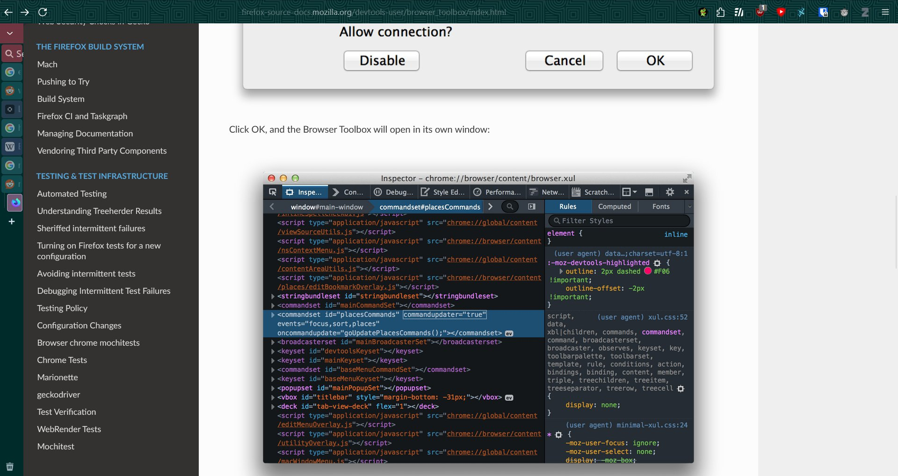

# firefox-config
Firefox configs for security, privacy, usability and performance

Install UBlock Origin, Sponsorblock, Decentraleyes, PrivacyBadger and Containers (eg. Google container, facebook container).

## Change user js

You can make firefox fully-suited to your needs and for the maximum security, privacy, usability and performance without very much tweaking by changing the user js in your browser profile.

Firefox profiles are located by default in `~/.mozilla/firefox/` in Linux and `%APPDATA%\Mozilla\Firefox\Profiles\` in Windows.

- Create a new Firefox profile or use an existing one and move to the profile directory. You can navigate to `about:profiles` and find the location for your current profile's root directory as well as find the option to create a new profile.
- If you want to try this out, you can go with creating a new profile.
- Copy user.js to your profile's root directory test it out for sometime and make the required changes in your original profile.
- For changing some prefs you can create a new file in profile's Root Directory, `user-overrides.js` and fill it with the prefs you want to override. Now, append the content at the end of `user.js` file. You can download from [here](https://github.com/prirai/firefox-config/raw/main/user.js).
- Done! Happy browsing.

The user.js file is taken from various other preexisting projects like arkenfox, betterfox and other projects and modified to suite the needs of a normal user.

## Manual Hardening

Refer to this guide - [The Hitchhiker’s Guide to Online Anonymity](https://anonymousplanet.org/guide.html#firefox-1)

## Custom UserChrome (Browser Styling)

If you also want to change the appearance of Firefox, you can try searching for some userchrome projects on [GitHub](https://github.com/search?q=firefox%20userchrome&type=repositories) or elsewhere and giving them a try. The `chrome/` folder in this repo contains a minimal `userChrome.css` that works with the [firefox-csshacks](https://github.com/MrOtherGuy/firefox-csshacks) styles — see the section below for setup instructions.

### Using firefox-csshacks

You can also use the [firefox-csshacks](https://github.com/MrOtherGuy/firefox-csshacks) repo for a wide variety of CSS styles. To set it up alongside this config:

1. Open a terminal and `cd` into your Firefox profile folder (see the "Change user js" section above for the profile location).
2. If you already have a `chrome` folder, rename it before cloning. After cloning, copy the contents of the old folder into the new `chrome` folder.
3. Clone the repository into the `chrome` folder:

       git clone https://github.com/MrOtherGuy/firefox-csshacks.git chrome

4. (Optional) Copy `userChrome_example.css` to `userChrome.css` and `userContent_example.css` to `userContent.css` inside the `chrome` folder.
5. `@import` individual style files into your `userChrome.css`. All `@import` statements must be placed before anything else in the file. Check `userChrome_example.css` for how it uses `@import`.
6. Restart Firefox for the changes to take effect.

Afterwards, run `git pull` inside the `chrome` folder to update to the latest styles. `git pull` will not overwrite your `userChrome.css` or `userContent.css`, so you can safely add custom rules to those files.

## About Config Documentation and other tricks

- A few of the nifty tricks used are present in the `tricks.md` file.
- Flags mentioned in the about:config are largely undocumented. Here's an effort to document most of the flags present. Intial pages are scraped from https://kb.mozillazine.org/ and are present in the `mzpages` directory.

If you really liked this project, star it and also contribute back.

## Extensions for Themes

- KDE Theme - [Here](https://addons.mozilla.org/en-US/firefox/addon/astitva-kde/?utm_source=addons.mozilla.org&utm_medium=referral&utm_content=search)
- Blue - [Here](https://addons.mozilla.org/en-US/firefox/addon/astitva-blue/?utm_source=addons.mozilla.org&utm_medium=referral&utm_content=search)
- Matte Glow - [Here](https://addons.mozilla.org/en-US/firefox/addon/astitva-matte-glow/?utm_source=addons.mozilla.org&utm_medium=referral&utm_content=search)
- OpenSUSE - [Here](https://addons.mozilla.org/en-US/firefox/addon/astitva-opensuse/?utm_source=addons.mozilla.org&utm_medium=referral&utm_content=search)

# References

- [Mozilla Central](https://searchfox.org/mozilla-central/source/browser/components/)
- [Arkenfox GUI](https://arkenfox.github.io/gui/)
- [Firefox Source - Search Toolkit](https://firefox-source-docs.mozilla.org/toolkit/search/)
- [Data Sanitization — Firefox Source Docs documentation](https://firefox-source-docs.mozilla.org/toolkit/components/antitracking/anti-tracking/data-sanitization/index.html)
